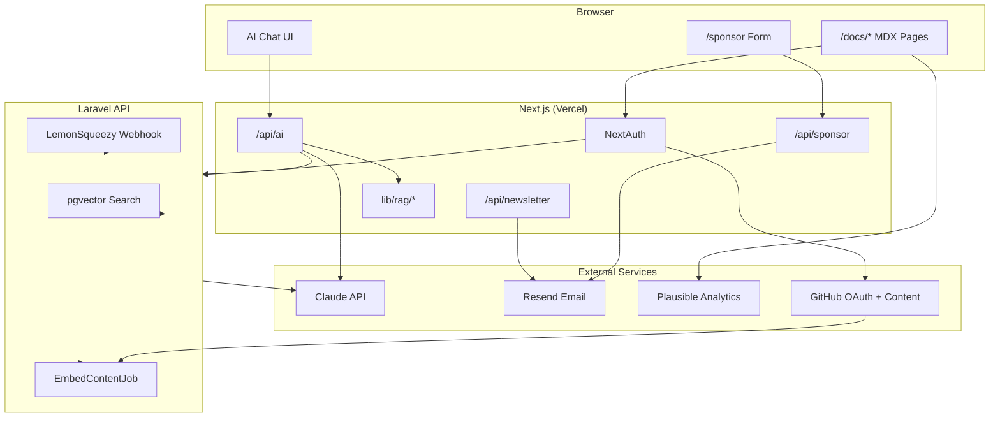

# สรุปสิ่งที่ทำไปในแต่ละ Phase — ThaiDevDocs Platform

> เอกสารนี้อธิบายว่าแต่ละ Phase ทำอะไรไปแล้ว ไฟล์ไหนเกี่ยวข้อง และฟังก์ชัน/คอมโพเนนต์หลักทำหน้าที่อะไร  
> อัปเดต: มิถุนายน 2026 · อ้างอิงจาก `thaidevdocs-plan.md` และ codebase จริง

---

## สารบัญ

1. [ภาพรวมและโครงสร้างโปรเจค](#1-ภาพรวมและโครงสร้างโปรเจค)
2. [Timeline Phase 1 — Platform Setup + Seed Content](#2-timeline-phase-1--platform-setup--seed-content)
3. [Timeline Phase 2 — Community Features](#3-timeline-phase-2--community-features)
4. [Timeline Phase 3 — AI Q&A System](#4-timeline-phase-3--ai-qa-system)
5. [Timeline Phase 4 — SEO + Launch](#5-timeline-phase-4--seo--launch)
6. [Content Phase 1 — Seed Content (15 บทความ)](#6-content-phase-1--seed-content-15-บทความ)
7. [Content Phase 2 — V1.0 (50 บทความ)](#7-content-phase-2--v10-50-บทความ)
8. [Content Phase 3 — Community + Premium](#8-content-phase-3--community--premium)
9. [Sponsor Onboarding Flow](#9-sponsor-onboarding-flow)
10. [สิ่งที่ยังไม่เสร็จ / รอ Production](#10-สิ่งที่ยังไม่เสร็จ--รอ-production)
11. [แผนภาพสถาปัตยกรรม](#11-แผนภาพสถาปัตยกรรม)

---

## 1. ภาพรวมและโครงสร้างโปรเจค

ThaiDevDocs เป็น **docs platform ภาษาไทย** สำหรับ Laravel, Vue, DevOps, AI และ Thai Context — สร้างด้วย Next.js + Fumadocs และมี Laravel API สำหรับ AI Q&A, billing และ embedding

### โครงสร้างโฟลเดอร์หลัก

```text
ThaiDevDocs-Platform/
├── app/                    # Next.js App Router (pages, API routes)
├── components/             # React components (UI, docs, AI, sponsor)
├── content/docs/           # บทความ MDX ทั้งหมด
├── data/                   # sponsors.json, sponsors.example.json
├── docs/                   # เอกสารภายใน (launch checklist, runbook)
├── lib/                    # Logic ฝั่ง Next.js (auth, RAG, SEO, newsletter)
├── scripts/                # CLI scripts (QA, smoke test, sponsor inquiries)
├── apps/api/               # Laravel 11 API (AI, billing, embedding)
└── thaidevdocs-plan.md     # แผนหลักของโปรเจค
```

### จำนวนบทความปัจจุบัน (ไม่รวม index และ test)

| หมวด | จำนวน | โฟลเดอร์ |
|---|---:|---|
| Laravel | 19 | `content/docs/laravel/` |
| Vue | 10 | `content/docs/vue/` |
| DevOps | 11 | `content/docs/devops/` |
| AI | 8 | `content/docs/ai/` |
| Thai Context | 12 | `content/docs/thai-context/` |
| **รวม** | **60** | |

Premium (Pro only): 4 บทความ · Community Phase 3: 6 บทความ Laravel ใหม่

---

## 2. Timeline Phase 1 — Platform Setup + Seed Content

**เป้าหมาย:** ให้ platform ทำงานได้ มี navigation, layout และ seed content 15 บทความ

### สิ่งที่ทำไปแล้ว

- Bootstrap Next.js + Fumadocs + MDX pipeline
- Sidebar navigation 5 หมวด: Laravel / Vue / DevOps / AI / Thai Context
- Breadcrumb, Table of Contents (desktop + mobile)
- Dark mode (system preference)
- Algolia DocSearch config (ใช้ได้เมื่อตั้ง env)
- Footer: GitHub, Contribute, Sponsor, Login

### ไฟล์สำคัญ

| ไฟล์ | หน้าที่ |
|---|---|
| `source.config.ts` | กำหนด schema frontmatter ของทุกบทความ MDX |
| `lib/source.ts` | โหลด content จาก Fumadocs, สร้าง page tree |
| `lib/layout.shared.tsx` | ตั้งค่า nav ร่วม (ชื่อ site, links) |
| `app/layout.tsx` | Root layout — font, analytics shell |
| `app/docs/layout.tsx` | Docs layout + sidebar จาก page tree |
| `app/docs/[[...slug]]/page.tsx` | หน้าแสดงบทความ MDX |
| `content/docs/meta.json` | ลำดับหมวดหลักใน sidebar |
| `content/docs/*/meta.json` | ลำดับบทความในแต่ละหมวด |
| `components/algolia-search.tsx` | ปุ่มค้นหา DocSearch |
| `components/site-footer.tsx` | Footer links |
| `components/mdx.tsx` | ลงทะเบียน MDX components (Callout, Cards ฯลฯ) |

### ฟังก์ชัน / API หลัก

#### `source.config.ts`

| ชื่อ | ทำอะไร |
|---|---|
| `docsPageSchema` | Zod schema บังคับ frontmatter: `title`, `topic`, `difficulty`, `verified_at`, `is_premium` ฯลฯ |
| `docs` | กำหนด collection MDX ที่ `content/docs/` |

#### `lib/source.ts`

| ชื่อ | ทำอะไร |
|---|---|
| `source` | Fumadocs loader — ใช้ดึง pages, tree, static params |
| `getPageImage()` | สร้าง URL รูป OG ของบทความ |
| `getPageMarkdownUrl()` | URL สำหรับ export markdown |
| `getLLMText()` | จัด format ข้อความสำหรับ `/llms.txt` routes |

#### `lib/layout.shared.tsx`

| ชื่อ | ทำอะไร |
|---|---|
| `baseOptions()` | คืนค่า config สำหรับ Fumadocs layout: nav links (Contribute, Pricing, Login), GitHub URL |

#### `app/docs/[[...slug]]/page.tsx`

| ชื่อ | ทำอะไร |
|---|---|
| `Page` | Render บทความ MDX พร้อม TOC, breadcrumb, metadata, footer |
| `generateStaticParams()` | Pre-render ทุก route `/docs/*` ตอน build |
| `generateMetadata()` | SEO metadata ต่อบทความ |

---

## 3. Timeline Phase 2 — Community Features

**เป้าหมาย:** ให้ community contribute ผ่าน GitHub PR และมี UX อ่าน docs ที่ดี

### สิ่งที่ทำไปแล้ว

- GitHub OAuth login (NextAuth.js)
- Profile page แสดงบทความที่ contribute
- Giscus comments ท้ายบทความ
- ปุ่ม "Edit on GitHub" + หน้า `/contribute`
- GitHub PR template + issue template สำหรับ suggest update
- Version badge + banner เมื่อบทความ outdated (>6 เดือน)
- Reading progress bar, reading time, helpful vote
- Plausible analytics + custom events

### ไฟล์สำคัญ

| ไฟล์ | หน้าที่ |
|---|---|
| `lib/auth-config.ts` | NextAuth GitHub provider |
| `lib/auth.ts` | `getSession()` ฝั่ง server |
| `lib/api-client.ts` | Sync user ไป Laravel API |
| `app/api/auth/[...nextauth]/route.ts` | NextAuth handler |
| `app/api/auth/sync/route.ts` | Sync session → Laravel |
| `app/login/page.tsx` | หน้า login |
| `app/profile/page.tsx` | หน้า profile + contributed articles |
| `app/contribute/page.tsx` | คู่มือ contribute + Phase 3 topics |
| `components/comments.tsx` | Giscus widget |
| `components/comments-lazy.tsx` | Lazy load Giscus (performance) |
| `components/edit-on-github-button.tsx` | ลิงก์ไปแก้ MDX บน GitHub |
| `components/version-badge.tsx` | แสดง "Verified: Laravel 11" |
| `components/outdated-banner.tsx` | แจ้งเตือนบทความเก่า |
| `components/suggest-update-button.tsx` | เปิด GitHub issue แจ้งแก้ไข |
| `components/reading-progress.tsx` | แถบ progress ด้านบนขณะ scroll |
| `components/article-meta.tsx` | Badge, reading time, difficulty, Pro tag |
| `components/article-footer.tsx` | Helpful vote + newsletter + comments |
| `components/helpful-vote.tsx` | ปุ่ม 👍/👎 → Plausible |
| `components/article-view-tracker.tsx` | Track `article_view` event |
| `lib/article-utils.ts` | คำนวณ reading time, ตรวจ stale |
| `lib/plausible.ts` | Helper ส่ง custom events |
| `scripts/check-stale-content.mjs` | CI script ตรวจบทความเก่า |

### ฟังก์ชัน / คอมโพเนนต์หลัก

#### Auth

| ชื่อ | ไฟล์ | ทำอะไร |
|---|---|---|
| `authOptions` | `lib/auth-config.ts` | ตั้ง GitHub OAuth, JWT callback, sync `isPro` |
| `isAuthConfigured()` | `lib/auth-config.ts` | ตรวจว่ามี `GITHUB_CLIENT_ID/SECRET` หรือไม่ |
| `getSession()` | `lib/auth.ts` | อ่าน session ฝั่ง server component / API |
| `syncUserWithApi()` | `lib/api-client.ts` | POST profile ไป Laravel `/api/auth/sync` |

#### Article UX

| ชื่อ | ไฟล์ | ทำอะไร |
|---|---|---|
| `calculateReadingTime()` | `lib/article-utils.ts` | นับคำ → นาที (200 คำ/นาที) |
| `isArticleStale()` | `lib/article-utils.ts` | `true` ถ้า `verified_at` เกิน 6 เดือน |
| `formatVerifiedDate()` | `lib/article-utils.ts` | แสดงวันที่ตรวจสอบแบบอ่านง่าย |
| `userContributedToArticle()` | `lib/article-utils.ts` | ตรวจว่า user เป็น author/contributor หรือไม่ |
| `VersionBadge` | `components/version-badge.tsx` | แสดง version ที่ verify แล้ว |
| `OutdatedBanner` | `components/outdated-banner.tsx` | Banner เตือน + ปุ่ม suggest update |
| `SuggestUpdateButton` | `components/suggest-update-button.tsx` | เปิด issue template บน GitHub |
| `getGitHubEditUrl()` | `lib/shared.ts` | สร้าง URL แก้ไฟล์ MDX บน GitHub |
| `getSuggestUpdateIssueUrl()` | `lib/shared.ts` | สร้าง URL issue พร้อม pre-fill |

#### Analytics

| ชื่อ | ไฟล์ | ทำอะไร |
|---|---|---|
| `trackPlausibleEvent()` | `lib/plausible.ts` | เรียก `window.plausible()` จาก client |
| `PlausibleAnalytics` | `components/plausible-analytics.tsx` | โหลด Plausible script |
| `HelpfulVote` | `components/helpful-vote.tsx` | ส่ง event `helpful_vote` |
| `ArticleViewTracker` | `components/article-view-tracker.tsx` | ส่ง event `article_view` เมื่อเปิดบทความ |

---

## 4. Timeline Phase 3 — AI Q&A System

**เป้าหมาย:** AI Q&A ภาษาไทยจาก docs context, Pro gating, billing

### สิ่งที่ทำไปแล้ว

- RAG pipeline: ค้นหา sections จาก MDX → ส่ง context ให้ Claude
- Dual backend: Next.js fallback (keyword search) + Laravel API (pgvector)
- Streaming response แบบ real-time
- Rate limit 20 queries/วัน ต่อ Pro user
- Premium articles blur สำหรับ non-Pro
- LemonSqueezy webhook → activate/cancel Pro
- Pricing page + billing page + Discord invite

### ไฟล์สำคัญ — Next.js

| ไฟล์ | หน้าที่ |
|---|---|
| `components/ai-chat.tsx` | UI แชท AI ลอยมุมขวา |
| `components/ai-chat-lazy.tsx` | Lazy load AI chat (ลด bundle size) |
| `components/premium-gate.tsx` | Blur เนื้อหา premium + CTA upgrade |
| `app/api/ai/route.ts` | API หลัก: Pro check → rate limit → stream |
| `app/api/ai/usage/route.ts` | คืนค่า usage รายวัน |
| `lib/rag/load-sections.ts` | Parse MDX → sections ตาม heading |
| `lib/rag/search.ts` | Keyword/token search (fallback RAG) |
| `lib/rag/types.ts` | System prompt ไทย + limit 20/วัน |
| `lib/rate-limit.ts` | เก็บ quota ใน `.data/ai-usage.json` |
| `lib/subscription.ts` | ตรวจ Pro status, checkout URLs |
| `lib/pro-access.ts` | Dev bypass สำหรับทด Pro ใน local |
| `app/pricing/page.tsx` | หน้า Free vs Pro |
| `app/settings/billing/page.tsx` | จัดการ subscription |

### ไฟล์สำคัญ — Laravel API (`apps/api/`)

| ไฟล์ | หน้าที่ |
|---|---|
| `app/Services/AiQaService.php` | RAG + Claude streaming SSE |
| `app/Services/ContentSearchService.php` | pgvector cosine search |
| `app/Services/EmbeddingService.php` | สร้าง embedding vectors |
| `app/Jobs/EmbedContentJob.php` | Parse MDX → embed → เก็บ DB |
| `app/Http/Controllers/AiQaController.php` | Endpoint `/api/ai/qa` |
| `app/Http/Controllers/AiUsageController.php` | Usage รายวัน (Redis) |
| `app/Http/Controllers/AuthSyncController.php` | Sync GitHub user + คืน token |
| `app/Http/Controllers/LemonSqueezyWebhookController.php` | Webhook billing |
| `app/Http/Controllers/GitHubWebhookController.php` | Re-embed เมื่อ push content |
| `database/migrations/*_content_sections*` | ตาราง sections + vector |
| `database/migrations/*_ai_queries*` | Log คำถาม AI |
| `database/migrations/*_subscriptions*` | สถานะ Pro |

### ฟังก์ชัน / API หลัก

#### Next.js RAG + AI

| ชื่อ | ไฟล์ | ทำอะไร |
|---|---|---|
| `loadRagSections()` | `lib/rag/load-sections.ts` | อ่าน MDX ทั้งหมด แยกเป็น sections ตาม `##` heading |
| `buildRagContext()` | `lib/rag/load-sections.ts` | จัด format sections ที่ค้นเจอเป็น prompt context |
| `searchRagSections()` | `lib/rag/search.ts` | ให้คะแนน relevance จาก keywords ในคำถาม |
| `POST` | `app/api/ai/route.ts` | รับ chat → ตรวจ Pro → rate limit → stream คำตอบ |
| `getLastUserQuestion()` | `app/api/ai/route.ts` | ดึงข้อความ user ล่าสุดจาก chat history |
| `GET` | `app/api/ai/usage/route.ts` | คืน `{ used, remaining, limit }` |
| `getAiUsage()` | `lib/rate-limit.ts` | อ่านจำนวน query วันนี้ |
| `incrementAiUsage()` | `lib/rate-limit.ts` | เพิ่ม count + ปฏิเสธถ้าเกิน 20/วัน |

#### Subscription & Pro

| ชื่อ | ไฟล์ | ทำอะไร |
|---|---|---|
| `getSubscriptionStatus()` | `lib/subscription.ts` | คืน `{ isPro }` จาก session / dev override |
| `getCheckoutUrl()` | `lib/subscription.ts` | URL checkout LemonSqueezy monthly/annual |
| `getDiscordInviteUrl()` | `lib/subscription.ts` | Discord invite สำหรับ Pro |
| `isDevProEnabled()` | `lib/pro-access.ts` | เปิด bypass ด้วย env `NEXT_PUBLIC_DEV_PRO` |
| `isDevProLogin()` | `lib/pro-access.ts` | ตรวจ GitHub username ใน allowlist |
| `PremiumGate` | `components/premium-gate.tsx` | ถ้า `is_premium && !isPro` → blur + ปุ่ม upgrade |
| `AiChat` | `components/ai-chat.tsx` | UI แชท; แสดง login/upgrade prompt ถ้าไม่ใช่ Pro |

#### Laravel API

| ชื่อ | ไฟล์ | ทำอะไร |
|---|---|---|
| `AiQaService::streamAnswer()` | `AiQaService.php` | ค้น pgvector → inject context → stream Claude → log query |
| `ContentSearchService::search()` | `ContentSearchService.php` | Cosine similarity search บน embeddings |
| `EmbeddingService::embed()` | `EmbeddingService.php` | เรียก embedding API สร้าง vector 1536 dim |
| `EmbedContentJob::handle()` | `EmbedContentJob.php` | Batch embed ทุก section ใน MDX |
| `LemonSqueezyWebhookController` | webhook controller | Verify HMAC → activate/cancel Pro ใน DB |

### Flow AI Q&A (เข้าใจง่าย)

```text
User ถามคำถาม (ภาษาไทย)
    ↓
ตรวจ Login + Pro status
    ↓
ตรวจ rate limit (20/วัน)
    ↓
ค้นหา sections ที่เกี่ยวข้อง (RAG)
    ↓
ส่ง context + คำถาม → Claude (streaming)
    ↓
แสดงคำตอบ + source links ไปบทความ
```

---

## 5. Timeline Phase 4 — SEO + Launch

**เป้าหมาย:** SEO-ready, performance ดี, newsletter และ launch tooling

### สิ่งที่ทำไปแล้ว

- Metadata ทุก page: title, description, OG, Twitter card, canonical
- JSON-LD: Article + BreadcrumbList
- `/sitemap.xml`, `/robots.txt`
- Dynamic OG images ต่อบทความ
- Font Sarabun (`next/font`), lazy images, code-split AI/Comments
- Newsletter: signup, welcome email, weekly cron, launch/beta scripts
- Smoke test, env verify, Lighthouse audit scripts
- Launch checklist document

### ไฟล์สำคัญ

| ไฟล์ | หน้าที่ |
|---|---|
| `lib/seo.ts` | Helpers สร้าง metadata |
| `components/article-json-ld.tsx` | Schema.org สำหรับบทความ |
| `components/json-ld.tsx` | Render `<script type="application/ld+json">` |
| `app/sitemap.ts` | Sitemap ทุก static + docs routes |
| `app/robots.ts` | robots.txt (allow/disallow paths) |
| `app/og/docs/[...slug]/route.tsx` | สร้าง OG image 1200×630 |
| `components/mdx-image.tsx` | ใช้ `next/image` ใน MDX |
| `lib/newsletter.ts` | Subscribe + ส่ง email ผ่าน Resend |
| `components/newsletter-signup.tsx` | ฟอร์มสมัคร newsletter |
| `app/api/newsletter/route.ts` | POST subscribe |
| `app/api/newsletter/weekly/route.ts` | Cron ส่ง weekly (ต้องมี CRON_SECRET) |
| `app/api/newsletter/launch/route.ts` | Launch/beta email API |
| `scripts/smoke-test.mjs` | ทด critical paths บน production |
| `scripts/verify-production-env.mjs` | ตรวจ env vars ครบหรือไม่ |
| `scripts/lighthouse-audit.mjs` | วัด Lighthouse score |
| `scripts/send-weekly-newsletter.mjs` | CLI ส่ง newsletter |
| `scripts/send-launch-email.mjs` | CLI ส่ง launch/beta email |
| `docs/LAUNCH-CHECKLIST.md` | Checklist ก่อน launch |
| `vercel.json` | Cron weekly newsletter |

### ฟังก์ชัน / API หลัก

#### SEO

| ชื่อ | ไฟล์ | ทำอะไร |
|---|---|---|
| `createPageMetadata()` | `lib/seo.ts` | Metadata สำหรับ static pages |
| `createArticleMetadata()` | `lib/seo.ts` | Metadata + OG type `article` สำหรับ docs |
| `getSiteUrl()` | `lib/seo.ts` | Base URL จาก `NEXT_PUBLIC_SITE_URL` |
| `getCanonicalUrl()` | `lib/seo.ts` | สร้าง canonical URL |
| `ArticleJsonLd` | `components/article-json-ld.tsx` | JSON-LD Article + BreadcrumbList |
| `sitemap()` | `app/sitemap.ts` | รายการ URL ทั้งหมด + `lastModified` |
| `robots()` | `app/robots.ts` | กฎ crawler (disallow `/api/`, `/login` ฯลฯ) |

#### Newsletter

| ชื่อ | ไฟล์ | ทำอะไร |
|---|---|---|
| `addSubscriber()` | `lib/newsletter.ts` | บันทึก email ใน `.data/newsletter-subscribers.json` |
| `listSubscribers()` | `lib/newsletter.ts` | อ่านรายชื่อ subscribers |
| `sendWelcomeEmail()` | `lib/newsletter.ts` | อีเมลต้อนรับหลัง subscribe |
| `sendWeeklyNewsletter()` | `lib/newsletter.ts` | ส่ง top articles ให้ subscribers ทั้งหมด |
| `sendLaunchAnnouncement()` | `lib/newsletter.ts` | อีเมลประกาศ v1.0 launch |
| `sendBetaInvite()` | `lib/newsletter.ts` | อีเมลเชิญ beta tester |
| `isResendConfigured()` | `lib/newsletter.ts` | ตรวจ `RESEND_API_KEY` + `RESEND_FROM_EMAIL` |
| `NewsletterSignup` | `components/newsletter-signup.tsx` | UI ฟอร์ม → POST `/api/newsletter` |

#### Content QA

| Script | ทำอะไร |
|---|---|
| `npm run content:validate` | ตรวจ frontmatter ครบทุก MDX |
| `npm run content:stale` | แจ้งบทความ `verified_at` เกิน 6 เดือน |
| `npm run content:qa` | ตรวจ code fence language, links, JSON |
| `npm run content:check` | รันทั้ง 3 ข้างบน |

---

## 6. Content Phase 1 — Seed Content (15 บทความ)

**เป้าหมาย:** 15 บทความคุณภาพดีก่อน launch

### Laravel Core (10 บทความ)

| Slug | หัวข้อ |
|---|---|
| `eloquent-relationships` | Eloquent Relationships ครบทุก type |
| `eager-loading` | Eager Loading & N+1 |
| `eloquent-scopes` | Local + Global Scopes |
| `query-builder-vs-eloquent` | Query Builder vs Eloquent |
| `eloquent-events-observers` | Events & Observers |
| `queue-jobs` | Queue & Jobs |
| `service-container` | Service Container & DI |
| `policies-gates` | Policies & Gates |
| `api-resources` | API Resources |
| `testing-pest` | Testing ด้วย Pest |

### Thai Context (5 บทความ)

| Slug | หัวข้อ |
|---|---|
| `omise-promptpay` | Omise + PromptPay |
| `pdpa` | PDPA compliance |
| `line-messaging-api` | LINE Messaging API |
| `dbd-api` | DBD API |
| `thai-date-format` | วันที่แบบไทย (พ.ศ.) |

**ไฟล์ config:** `content/docs/laravel/meta.json`, `content/docs/thai-context/meta.json`

---

## 7. Content Phase 2 — V1.0 (50 บทความ)

**เป้าหมาย:** ขยายเป็น ~50 บทความ — Vue, DevOps, AI, Thai Context เพิ่ม

### Vue.js (10 บทความ) — `content/docs/vue/`

`composition-api`, `pinia-state-management`, `inertia-laravel`, `vue-typescript`, `component-patterns`, `vue-router-4`, `vue-testing-vitest`, `vite-laravel-config`, `vue-composables`, `vue-error-handling`

### DevOps (10 บทความ) — `content/docs/devops/`

`docker-laravel`, `docker-compose`, `github-actions-laravel`, `azure-devops-pipeline`, `laravel-forge`, `nginx-laravel`, `mysql-optimization`, `redis-laravel`, `env-management`, `laravel-monitoring`

### AI Integration (8 บทความ) — `content/docs/ai/`

`claude-api-php`, `langgraph-js`, `pgvector-postgresql`, `rag-pattern`, `line-bot-ai`, `ai-code-review`, `embeddings-semantic-search`, `prompt-engineering-laravel`

### Thai Context เพิ่ม (7 บทความ) — `content/docs/thai-context/`

`scb-easy-payment`, `kbank-kplus-api`, `truemoney-wallet-api`, `ndid-digital-id`, `thai-tax-calculation`, `thai-phone-otp`, `thai-address-format`

---

## 8. Content Phase 3 — Community + Premium

**เป้าหมาย:** บทความ community รับ PR + premium Pro content

### Community Laravel (6 บทความใหม่)

| Slug | หัวข้อ |
|---|---|
| `advanced-testing-pest` | Feature tests, mocking |
| `livewire-alpine` | Livewire + Alpine.js |
| `laravel-octane` | Laravel Octane + Swoole |
| `microservices-laravel` | Microservices กับ Laravel |
| `graphql-laravel` | GraphQL + Lighthouse |
| `performance-optimization-advanced` | Performance ขั้นสูง |

### Premium Pro-only (4 บทความ)

| Slug | หมวด | หัวข้อ |
|---|---|---|
| `building-saas-laravel` | Laravel | สร้าง SaaS full guide |
| `security-hardening` | Laravel | Security hardening |
| `database-design-thai-business` | Laravel | Database design ไทย |
| `production-deployment-checklist` | DevOps | Production deployment checklist |

**Frontmatter สำคัญ:** `is_premium: true` → ถูก gate โดย `PremiumGate` ใน `app/docs/[[...slug]]/page.tsx`

**หน้าที่อัปเดต:**
- `content/docs/laravel/index.mdx` — Cards บทความ Phase 3
- `app/contribute/page.tsx` — รายการ topics ที่เปิดรับ PR
- `thaidevdocs-plan.md` — checkbox Phase 3 ครบแล้ว

---

## 9. Sponsor Onboarding Flow

**เป้าหมาย:** ระบบรับ sponsor inquiry + แสดง sidebar ใน docs

### สิ่งที่ทำไปแล้ว

- หน้า `/sponsor` — packages, FAQ, sidebar preview, inquiry form
- API รับ inquiry → เก็บ local + ส่ง email (Resend)
- Sidebar ใน docs TOC (desktop + mobile)
- Runbook สำหรับ maintainer + CLI ดู inquiries
- Plausible tracking: `sponsor_click`, `sponsor_inquiry_submit`

### ไฟล์สำคัญ

| ไฟล์ | หน้าที่ |
|---|---|
| `app/sponsor/page.tsx` | Landing page sponsor |
| `app/api/sponsor/route.ts` | POST รับ inquiry form |
| `lib/sponsor-packages.ts` | นิยามแพ็กเกจ Sidebar / Featured |
| `lib/sponsor-inquiries.ts` | บันทึก inquiry + ส่ง email |
| `lib/sponsors.ts` | อ่าน active sponsors จาก JSON |
| `data/sponsors.json` | รายชื่อ sponsor ที่ live (ปัจจุบันว่าง `[]`) |
| `data/sponsors.example.json` | ตัวอย่าง format |
| `docs/SPONSOR-ONBOARDING.md` | Runbook สำหรับ maintainer |
| `scripts/list-sponsor-inquiries.mjs` | CLI ดู/อัปเดต inquiry |
| `components/sponsor-inquiry-form.tsx` | ฟอร์ม client-side |
| `components/sponsor-sidebar.tsx` | การ์ด sponsor หรือ CTA |
| `components/docs-sponsor-sidebar.tsx` | Wrapper ฝังใน docs TOC |

### ฟังก์ชัน / API หลัก

#### Packages & Display

| ชื่อ | ไฟล์ | ทำอะไร |
|---|---|---|
| `SPONSOR_PACKAGES` | `lib/sponsor-packages.ts` | แพ็กเกจ Sidebar (฿3k–5k) และ Featured (฿8k–15k) |
| `SPONSOR_ONBOARDING_STEPS` | `lib/sponsor-packages.ts` | 4 ขั้นตอน onboarding |
| `getSponsorPackage()` | `lib/sponsor-packages.ts` | Lookup package จาก id |
| `getActiveSponsors()` | `lib/sponsors.ts` | คืน sponsor ที่ `active !== false` (max 2) |
| `areSponsorsEnabled()` | `lib/sponsors.ts` | Kill switch จาก env |
| `getSponsorContactEmail()` | `lib/sponsors.ts` | อีเมลติดต่อ (default `sponsors@thaidevdocs.com`) |
| `getSponsorCtaUrl()` | `lib/sponsors.ts` | URL CTA (default `/sponsor`) |
| `SponsorSidebar` | `components/sponsor-sidebar.tsx` | แสดง sponsor card หรือ "Become a sponsor" |
| `DocsSponsorSidebar` | `components/docs-sponsor-sidebar.tsx` | Inject sidebar ใน TOC footer |

#### Inquiry Pipeline

| ชื่อ | ไฟล์ | ทำอะไร |
|---|---|---|
| `createSponsorInquiry()` | `lib/sponsor-inquiries.ts` | บันทึก inquiry + rate limit 3/วัน/email + ส่ง email |
| `listSponsorInquiries()` | `lib/sponsor-inquiries.ts` | อ่านรายการ inquiry (filter by status ได้) |
| `updateSponsorInquiryStatus()` | `lib/sponsor-inquiries.ts` | เปลี่ยน status: pending → contacted → active |
| `isSponsorInquiryRateLimited()` | `lib/sponsor-inquiries.ts` | ตรวจ quota รายวันต่อ email |
| `POST` | `app/api/sponsor/route.ts` | Validate form + honeypot anti-spam |
| `SponsorInquiryForm` | `components/sponsor-inquiry-form.tsx` | UI ฟอร์ม + เลือก package |

### Flow Sponsor Onboarding

```text
Sponsor เปิด /sponsor
    ↓
เลือกแพ็กเกจ + กรอกฟอร์ม
    ↓
POST /api/sponsor
    ↓
บันทึก .data/sponsor-inquiries.json
    ↓
Resend → แจ้ง maintainer + auto-reply sponsor
    ↓
Maintainer review → ใบเสนอราคา → ชำระเงิน
    ↓
เพิ่ม entry ใน data/sponsors.json → deploy
    ↓
Sidebar แสดง sponsor ใน docs ทุกหน้า
```

---

## 10. สิ่งที่ยังไม่เสร็จ / รอ Production

งานเหล่านี้อยู่ใน plan แต่เป็น **ops/manual** หรือยัง `[ ]` ใน checklist:

| รายการ | สถานะ |
|---|---|
| Deploy Vercel production + custom domain | รอ setup |
| Algolia DocSearch approve + ทด search | รอยื่นคำขอ |
| LemonSqueezy สร้าง product Pro ใน dashboard | รอ setup |
| Giscus Discussions category setup | รอ setup |
| pgvector `ivfflat` index | ยังไม่ทำ |
| Plausible dashboard (top articles) | ยังไม่ทำ |
| Code block runnable review (`content:qa --php`) | บางส่วน |
| Sponsor คนแรกใน `data/sponsors.json` | ว่าง — แสดง CTA |
| Launch posts (Facebook, X, ProductHunt) | รอ launch |

ดูรายละเอียด: `docs/LAUNCH-CHECKLIST.md`

---

## 11. แผนภาพสถาปัตยกรรม

### ภาพรวมระบบ



### Data flow บทความ

```text
content/docs/**/*.mdx  (GitHub repo)
        │
        ├─► Fumadocs (SSG pages)
        ├─► RAG fallback (keyword search)
        ├─► EmbedContentJob → PostgreSQL pgvector
        └─► sitemap / JSON-LD / OG images
```

---

## ภาคผนวก — npm scripts ที่ใช้บ่อย

| คำสั่ง | ทำอะไร |
|---|---|
| `npm run dev` | รัน dev server |
| `npm run build` | Build production |
| `npm run content:check` | ตรวจ MDX ทั้งหมด |
| `npm run smoke:test` | Smoke test production URL |
| `npm run verify:production` | ตรวจ env vars |
| `npm run sponsor:inquiries` | ดู sponsor inquiries |
| `npm run newsletter:weekly` | ส่ง weekly newsletter |

---

## ภาคผนวก — Environment Variables สำคัญ

| Variable | ใช้กับ Phase |
|---|---|
| `NEXT_PUBLIC_SITE_URL` | Phase 4 SEO |
| `NEXT_PUBLIC_ALGOLIA_*` | Phase 1 Search |
| `GITHUB_CLIENT_*` / `NEXTAUTH_*` | Phase 2 Auth |
| `ANTHROPIC_API_KEY` / `API_URL` | Phase 3 AI |
| `LEMON_SQUEEZY_*` | Phase 3 Billing |
| `RESEND_*` / `CRON_SECRET` | Phase 4 Newsletter + Sponsor |
| `NEXT_PUBLIC_SPONSORS_*` / `SPONSOR_INQUIRY_NOTIFY_EMAIL` | Sponsor |
| `NEXT_PUBLIC_PLAUSIBLE_DOMAIN` | Phase 2 Analytics |

ดูครบ: `.env.local.example`

---

*เอกสารนี้สร้างจาก codebase จริง — ถ้ามี feature ใหม่ให้อัปเดตไฟล์นี้ควบคู่กับ `thaidevdocs-plan.md`*
